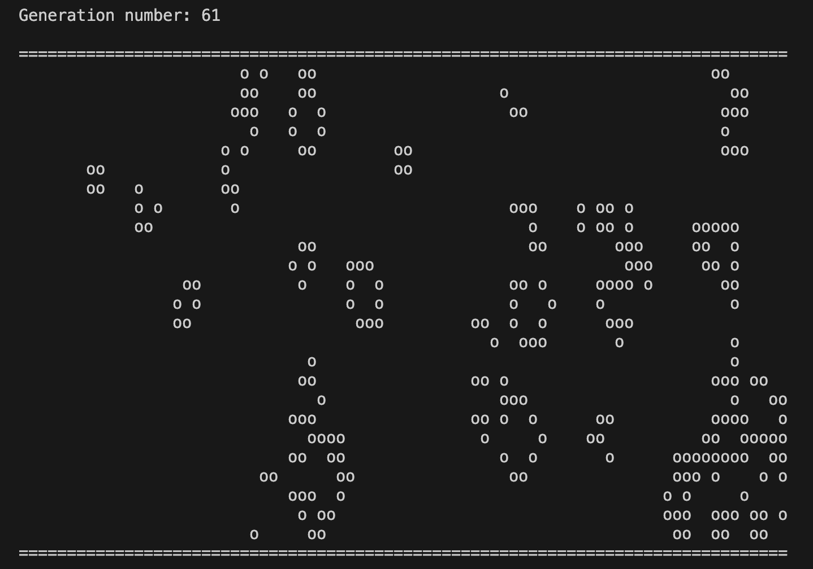

## 🌄 Game Life

### The GameLife is a visualization of the popular "The Game of Life"
🚀 Developed in a structured programming style in pure C language.

### 🏁 Start the Game

* To start the game - use `make build` and after `make start`.

### ⚙️ It is possible to customize the size of the playing field

* WIDTH_FIELD - field width
* HEIGHT_FIELD - field height
* You can change start-images with changing `START_FILE=start1.txt` in Makefile

### ℹ️ Info

* [Coverage analyzed during game test](tests/LCOV - report.pdf)
* You also can check it by `make test` and `make gcov-report`